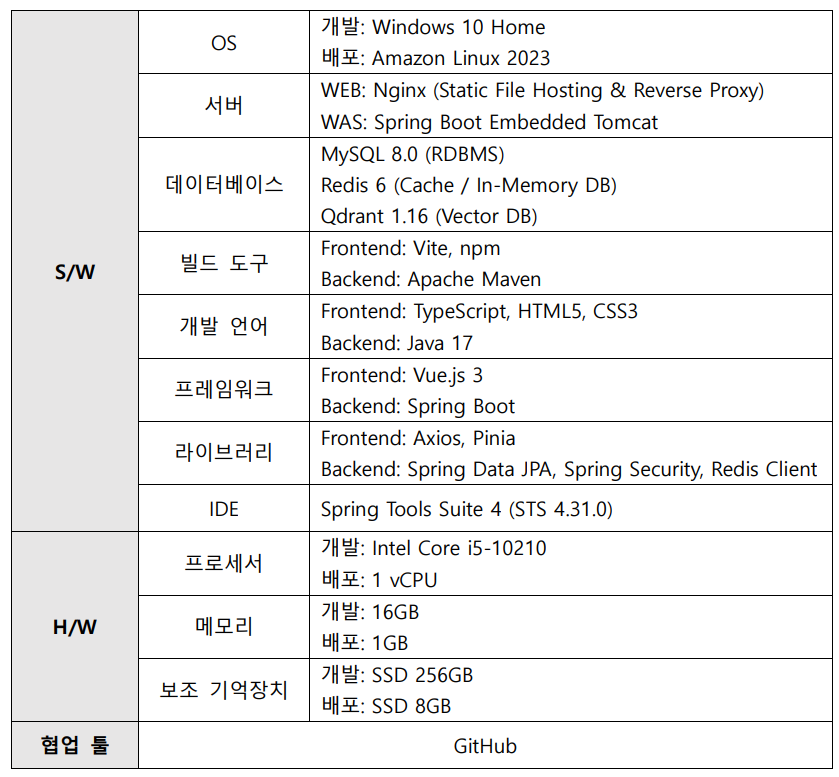
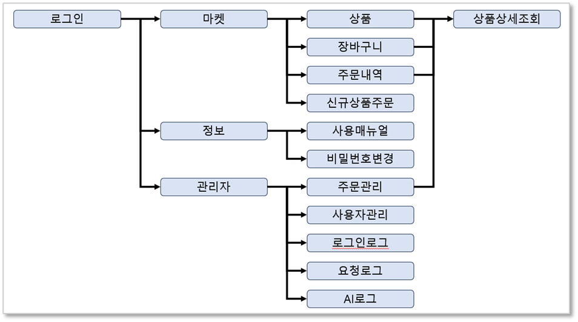
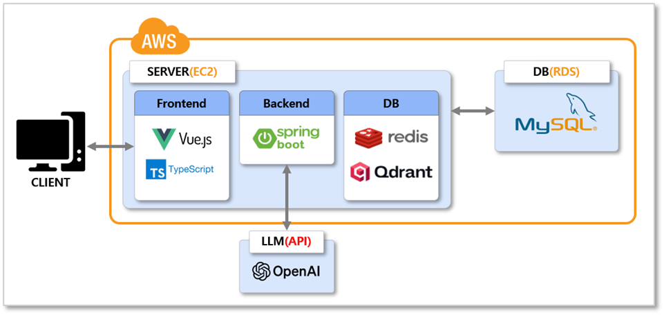

# miniPX

## 가. 개요

병역명문가 제도로 군마트(PX)에 자유롭게 출입이 가능하여 주변 지인들로부터 물건을 주문받아 조금씩 구매해주는 서비스를 시작하였다. 초기에는 메신저를 통해 주문받는 형식이었으나, 매번 주문을 정리해야 하는 불편함과 주문 누락 문제가 종종 발생하였다. 이러한 문제를 해결하고자 주문 과정 전체를 관리하는 시스템을 구현하게 되었다. 

시스템 운영 과정에서 상품 추천, 서비스 사용 방법 등에 대해 반복적인 문의가 발생하였다. 이러한 문의에 효과적으로 대응하기 위해 OpenAI API를 활용해 AI 상담사를 구축하였다.

* 서비스 URL: https://와싸다.com (https://xn--2j1bx81a8nc.com)

## 나. 개발 및 배포 환경

## 다. 메뉴 구조도

**1.** **마켓 메뉴**

상품 조회부터 주문까지의 핵심 비즈니스 흐름을 중심으로 구성하였다.

구매 과정은 **상품 → 장바구니 → 주문내역**으로 이어져 사용자가 자연스럽게 주문 프로세스를 따라갈 수 있도록 설계하였다.

**3.** **정보 메뉴**

상품 주문 이외에 시스템 이용 중 필요한 정보 관련 기능을 별도로 분리하였다.

**4.** **관리자 메뉴**

운영 및 관리 목적의 기능을 관리자 전용으로 구성하였다.

주문관리, 사용자관리를 통해 시스템 운영 전반을 관리할 수 있도록 하였다.

로그 관련 메뉴를 통해 시스템 이력 추적 및 장애·보안 분석이 가능하도록 설계하였다.

## 라. 서비스 구조도

* 본 서비스는 AWS EC2 환경에서 구동되는 단일 서버 기반의 웹 애플리케이션으로, 프런트엔드, 백엔드, 인메모리 DB 및 벡터 DB로 구성하였다.

* 프런트엔드는 Vue.js와 TypeScript를 사용하여 사용자 인터페이스를 구성하였으며, 백엔드는 Spring Boot 기반 서버로 비즈니스 로직을 처리한다.

* Redis는 캐시 및 세션 관리 용도로 활용되었고, Qdrant는 LLM 기반 기능을 위한 벡터 데이터 저장 및 검색에 사용되었다.

* 관계형 데이터는 AWS RDS(MySQL)에 저장되며, 백엔드 서버는 OpenAI API와 연동하여 AI 기능을 제공한다.

## 마. 산출물

<a href="./산출물/완료보고서/miniPX_완료보고서.pdf">miniPX_완료보고서.pdf</a>

<a href="./산출물/테이블 명세서/miniPX_테이블 명세서.xlsx">miniPX_테이블명세서.xlsx</a>

<a href="./산출물/요구사항 명세서/miniPX_요구사항_명세서.xlsx">miniPX_요구사항명세서.xlsx</a>

<a href="./산출물/화면정의서/miniPX_화면정의서.pptx">miniPX_화면정의서.pptx</a>

<a href="./산출물/사내튜터/AI상담사_구축_사례_공유.pdf">AI상담사_구축_사례_공유.pdf</a>